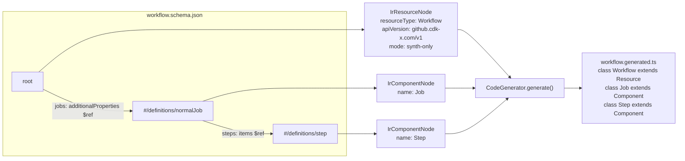

# @cdk-x/generator-toolkit — architecture guide

This package turns one vendored provider JSON Schema file into cdk-x L1 `Resource`/`Component` TypeScript source, fully automatically — no manifest, no human classification step. This document explains what each file does, how they fit together, and how far the current implementation actually generalizes beyond the GitHub Actions schema used to build it.

## Pipeline overview

```
vendored schema file (draft-07 JSON Schema)
        │
        ▼
JsonSchemaAdapter.toIr(schema, { resourceType, apiVersion, mode })
        │
        ▼
{ resource: IrResourceNode, components: IrComponentNode[] }   ← the IR
        │
        ├──────────────────────────────┐
        ▼                              ▼
CodeGenerator.generate()      DeployMetadataGenerator.generate()
        │                              │
        ▼                              ▼
*.generated.ts                *.deploy.generated.ts
(Resource + Component         (DEPLOY_CONFIGS map,
 classes extending             keyed by apiVersion +
 @cdk-x/core)                  resourceType)
```

## The classification rule (why there's no manifest)

1. **The schema file's own root is the Resource.** This holds for providers like GitHub, where each vendored schema file already represents exactly one resource type. It is **not** a universal law — it does not hold for a provider like Kubernetes, whose OpenAPI schema bundles many Kinds into a single file, each self-identified via `x-kubernetes-group-version-kind`. Supporting that shape would need a way to designate multiple roots within one file — a real extension point, deliberately not built yet (see Recommendation below).
2. **Every named `definitions` entry reachable via `$ref` from a Resource root is a Component.**
3. **Every property, of every kind — enums, `additionalProperties` maps, scalars, arrays, anonymous nested objects — is mapped into real generated TypeScript.** "Classification" (Resource vs. Component) only decides whether a shape gets its _own construct class_; it is not a filter on what gets represented at all. A shape that isn't classified as a Resource or Component still becomes a proper type: an inline object becomes a nested `interface` (`shape: 'inline-shape'`), a fixed set of string values becomes a real, dedicated `export enum` (`shape: 'enum'`) — not an inlined string-literal union, since jsii doesn't support those as a public property type — and so on. Nothing is silently dropped or left untyped; only Resources/Components additionally get their own class and (for Resources) an identity.

This is fully deterministic: re-running the generator against an unchanged schema produces unchanged output; adding a field to the vendored schema adds it to the next generated output; removing one removes it. No staged/pending state to keep in sync.

## File-by-file

### `src/lib/ir/ir.ts` — the intermediate representation

Pure types, no logic. This is the contract between "reading a schema" and "generating code," and it's deliberately format-agnostic — nothing in this file knows JSON Schema syntax exists.

| Type              | Meaning                                                                                                                          |
| ----------------- | -------------------------------------------------------------------------------------------------------------------------------- |
| `IrResourceNode`  | `resourceType`, `apiVersion`, `mode` (`"synth-only" \| "deploy"`), `properties` — the one deployable unit per schema file        |
| `IrComponentNode` | `name`, `properties` — no identifier fields at all; Components aren't independently addressable                                  |
| `IrProperty`      | `name` (original schema key, never renamed here), `type`, `required`, `description`                                              |
| `IrPropertyType`  | a discriminated union on `shape`: `primitive` \| `unknown` \| `array` \| `record` \| `enum` \| `component-ref` \| `inline-shape` |

### `src/internal/naming.ts` — `Naming`

Casing helpers (`toPascalCase`, `toCamelCase`, `isValidIdentifier`), not part of the public API. Used by the adapter to turn a definition key like `normalJob` into a class name (`NormalJob`), and by the generator to turn a non-identifier JSON key like `runs-on` into a valid class member (`runsOn`) while keeping the original string as the props-interface key and the `toProperties()` output key.

### `src/lib/json-schema-adapter/json-schema-adapter.ts` — `JsonSchemaAdapter`

**The only format-specific file in the package.** Converts one parsed draft-07 schema into IR:

1. `detectDialect()` checks `$schema`; throws on anything that isn't draft-07.
2. `toIr()` walks `schema.properties`. For every `$ref` it finds — directly on a property, inside an `array.items`, or inside `additionalProperties` — it resolves the target `#/definitions/<name>` and recursively converts it into an `IrComponentNode`, memoized by definition name (so a definition referenced twice is only processed once, and a self-referencing definition can't recurse forever).
3. The _shape_ of the reference (`single` / `array` / `map`) is derived purely from how the `$ref` is used in the schema — not from any naming convention.

Nothing in this file mentions "workflow," "job," or "step." Every name in the generated output comes from either the schema's own `definitions` keys (PascalCased) or the `resourceType`/`apiVersion`/`mode` values the _caller_ supplies.

### `src/lib/code-generator/code-generator.ts` — `CodeGenerator`

Also format-agnostic — consumes only IR, never touches the schema. Pure static string-builder (no template engine).

- One `export interface <X>Props` + one `export class <X> extends Resource|Component` per IR node.
- `component-ref` properties **never** appear in a props interface or constructor. A `Job` isn't data passed into `Workflow`'s constructor — it's a real child construct: `new Job(workflow, 'build', {...})`.
- `toProperties()` inlines Component children back in by walking `this.node.children`, filtered with `Component.isComponent()` — nothing more specific. **This is why at most one `component-ref` property per Resource/Component is supported today**: with no per-subclass discrimination (`instanceof Job` etc. was deliberately ruled out), there'd be no way to tell two different collections' children apart. `CodeGenerator` throws a clear error rather than guessing if it ever sees two.
- `enum`-typed properties are collected across the whole file, deduplicated by name, and emitted once each as a real `export enum <Name> { Member = 'value', ... }` declaration up top — every referencing property points at the enum by name. This isn't a style choice: jsii doesn't support TypeScript string-literal unions as a public property type (only interfaces/classes/enums/primitives translate into its other language targets), so inlining `'a' | 'b'` would fail `jsii-compile` for any jsii-enabled consumer.

### `src/lib/deploy-metadata-generator/deploy-metadata-generator.ts` — `DeployMetadataGenerator`

Also IR-only. Emits a tiny second file per Resource — `DEPLOY_CONFIGS['<apiVersion>/<resourceType>'] = { mode: 'synth-only' | 'deploy' }` — kept separate from the Resource's own class because deploy mode is metadata for a not-yet-built deploy engine and never changes the generated shape.

### `src/index.ts`

Public barrel: `JsonSchemaAdapter`, `CodeGenerator`, `DeployMetadataGenerator`, and every IR type. This is what the (not yet built) `@cdk-x/nx:generate-l1` executor will import and call in-process.

## Worked example: GitHub Actions Workflow (pruned)



## Is this generic beyond GitHub, or GitHub-specific?

| Layer                          | Generic?                                                                                                                                                                                                                                                                                                                                         |
| ------------------------------ | ------------------------------------------------------------------------------------------------------------------------------------------------------------------------------------------------------------------------------------------------------------------------------------------------------------------------------------------------ |
| `ir.ts`                        | Yes — zero format-specific code                                                                                                                                                                                                                                                                                                                  |
| `naming.ts`                    | Yes — plain string casing                                                                                                                                                                                                                                                                                                                        |
| `code-generator.ts`            | Yes — consumes IR only                                                                                                                                                                                                                                                                                                                           |
| `deploy-metadata-generator.ts` | Yes — consumes IR only                                                                                                                                                                                                                                                                                                                           |
| `json-schema-adapter.ts`       | Generic to **any draft-07 JSON Schema** shaped as "root object + `$ref`'d definitions" — not GitHub-specific, but _is_ draft-07-specific. An OpenAPI-based provider, or a schema on a different JSON Schema dialect (2020-12, etc.), would need a **new adapter**, not changes to this one — that's exactly the seam the IR was designed around. |

**Known, deliberate limitations today** (not bugs — things not built because nothing real needs them yet):

1. **One Resource per vendored schema file** — the file's root is the only Resource. Fine for GitHub; wrong for a schema like Kubernetes' that bundles many Kinds into one file. Supporting that needs a way to designate multiple roots within one file, not yet designed.
2. Only local `#/definitions/<name>` refs are resolved — no cross-file `$ref` (a schema split across multiple files needs to be pre-merged, or a future adapter enhancement).
3. At most one `component-ref` property per node — `CodeGenerator` throws instead of guessing if a schema ever has two.
4. No `readOnly`/`createOnly`-style metadata — dropped from the IR since nothing consumes it yet.
5. No `oneOf`/`anyOf`/`allOf`/conditional schema support — only the "plain object with properties" subset of draft-07.

## Recommendation

Validate end-to-end against the real GitHub Actions schema first (the Phase 3 PoC). Don't generalize `JsonSchemaAdapter` further based on guesses about what a hypothetical second provider might need — extend it only once a second real schema actually hits one of the limitations above, informed by what specifically broke.
